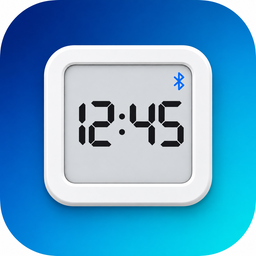

# Xiaomi LYWSD02 Clock

Keeps a Xiaomi LYWSD02 e-ink clock on time over Bluetooth, through your existing
Home Assistant Bluetooth proxies. No ESP node has to own the job, and no phone app
is needed after setup.

Passive temperature, humidity and battery already come from core **Xiaomi BLE**.
This integration only does the part that needs an actual GATT connection.

## Why this exists

The LYWSD02 has no time source of its own. Left alone it drifts, and the only
official way to correct it is to open the Mi Home app next to it.

The usual community answer is an ESPHome `ble_client` on a nearby ESP32. That
works, but it pins the clock to one specific node: rebuild or replace that node
and the sync silently disappears, taking any watchdog automation with it. Since
`bluetooth_proxy: active: true` publishes *connection slots* — not just
advertisements — a GATT write can just as well originate in Home Assistant and
travel through whichever proxy currently hears the clock best. That is what this
does, and it means:

- **No node ownership.** Any connectable proxy will do; HA picks by signal.
- **DST is free.** Home Assistant already knows your timezone, so a transition
  triggers a re-sync instead of needing offset bookkeeping on a microcontroller.
- **Nothing to reflash** to change the schedule or tolerance.
- **~28 KB of flash and a BLE connection slot** handed back to the ESP node.

## What you get

| Entity | Purpose |
|---|---|
| `button.<clock>_time_sync` | Force a time write now |
| `sensor.<clock>_sync_age` | Hours since the last **verified** write — the thing to alert on |
| `sensor.<clock>_drift` | Seconds the clock was wrong by, sampled *before* the last correction |
| `select.<clock>_display_units` | °C / °F on the clock's own face (read back from the device) |

A sync runs automatically every 24 h (configurable), whenever your UTC offset
changes, and whenever you press the button.

### Two deliberate choices

**`sync_age` never goes unavailable.** It is HA-side derived state, so if the
clock falls out of range the number keeps climbing — which is exactly what a
watchdog should trigger on. An `unavailable` entity would hide a dead clock
instead of reporting it. It also carries no `state_class`: a sawtooth that resets
to zero on every sync has no meaningful hourly mean, so it stays out of long-term
statistics.

**A write ack is not success.** Accepting five bytes only proves the length was
legal. Every sync reads the time back and only records success when the clock's
own answer is within tolerance (5 s by default), so a wrong byte order or
timezone convention shows up as a failure instead of a green tick.

Example watchdog:

```yaml
- alias: Clock time sync watchdog
  triggers:
    - trigger: numeric_state
      entity_id: sensor.living_room_clock_sync_age
      above: 30
  actions:
    - action: persistent_notification.create
      data:
        title: Clock is drifting
        message: >-
          Last verified BLE time write was
          {{ states('sensor.living_room_clock_sync_age') | float(0) | round(1) }} h ago.
```

## Install

### HACS (custom repository)

1. HACS → **Integrations** → ⋮ → **Custom repositories**
2. Repository: `nphil/ha-lywsd02`, Category: **Integration** → **Add**
3. Find **Xiaomi LYWSD02 Clock** in HACS, **Download**, then restart Home Assistant
4. **Settings → Devices & Services → Add Integration → Xiaomi LYWSD02 Clock**

The clock is usually discovered on its own, in which case it appears as a
discovered device and you only need to confirm it.

### Manual

Copy `custom_components/lywsd02` into your `config/custom_components/` and restart.

## Configuration

Discovery matches on the advertised local name `LYWSD02*`. Note that the clock
never advertises its GATT service UUID — that only appears after connecting — so
matching on `ebe0ccb0-…` finds nothing. If yours is not discovered, add it
manually and pick it from the list of clocks the proxies can currently reach.

**Options** (integration → Configure): hours between syncs (default 24) and the
read-back tolerance in seconds (default 5).

## Services

| Service | Use |
|---|---|
| `lywsd02.dump_gatt` | Log the device's whole service/characteristic table with the value and length of everything readable |
| `lywsd02.write_char` | Write a raw payload to one characteristic, logging the value before and after |

These exist because this device's protocol is entirely reverse-engineered and its
firmware revisions disagree. When a write is refused, reading the device's own
GATT table beats trusting a blog post — so that capability ships here instead of
living in someone's throwaway script. `write_char` is sharp: it logs the previous
value precisely so a probe is reversible.

## Protocol notes

Everything lives under service `ebe0ccb0-7a0a-4b0c-8a1a-6ff2997da3a6`.

| Characteristic | Bytes | Meaning |
|---|---|---|
| `ebe0ccb7` | 5, R/W | `<I` epoch + `b` timezone in whole hours. The device is timezone-naive: it renders `epoch + tz*3600` |
| `ebe0ccbe` | 1, R/W | Display units — `0x01` = °F, `0xFF` = °C |
| `ebe0ccc4` | 1, R | Battery % |
| `ebe0ccc1` | 3, R/N | Live temperature/humidity, `<hB`, temperature /100 |
| `ebe0ccb9` | 8, R | History record counters |
| `ebe0ccba` | 4, R/W | History record index |
| `ebe0ccbc` | N | History records, `<IIhBhB` = idx, ts, max temp, max hum, min temp, min hum |

Because the timezone byte only holds whole hours, sub-hour zones (India,
Newfoundland) would be unrepresentable — so the remainder is folded into the
epoch instead, which keeps the displayed time correct anywhere.

### 12/24-hour mode is not available on the LYWSD02

Asked and answered the hard way. Other integrations expose a `clock_mode`
parameter that writes a 7-byte payload (`<IHB` = `0, 0, 0xAA`) to the *time*
characteristic. On this hardware that cannot work, and four independent sources
agree:

1. The device's own GATT table reports `ebe0ccb7` as **5 bytes** (firmware
   `1.1.2_0097`, hardware `F2_LN`).
2. Attempting the 7-byte write returns GATT **error 13, `Invalid attribute
   length`**.
3. `koenvervloesem/bluetooth-clocks`, which supports many clock models and has an
   `ampm` argument, documents: *"The Xiaomi LYWSD02 ignores this argument, as it
   doesn't support this option."*
4. The most-used community tool (saso5's Web Bluetooth page) offers time,
   timezone, a 30-minute offset and °C/°F — and no 12/24 switch.

Writing `0x01` to `ebe0ccd3` (the one writable single-byte register in the vendor
service) is accepted but does not persist — it reads back `0x00`. Xiaomi's
"12/24-hour selectable" spec line describes the newer **LYWSD02MMC**, a different
device. If your unit reports `LYWSD02MMC`, this is worth revisiting.

Rather than ship a control that always errors, there isn't one.

## Notes on device rows

Home Assistant no longer merges devices across config entries — as of the 2026
registry, `async_get_or_create` performs its lookup with `config_entry_id=`, and
previously merged devices were *split* into one row per entry. So this
integration always gets its own device row alongside Xiaomi BLE's, for the same
physical clock. What it does do is look the clock up unscoped and adopt whatever
you named that device, so entity ids inherit your naming convention instead of a
MAC address.

## Credits

Built on prior reverse engineering by
[ashald/home-assistant-lywsd02](https://github.com/ashald/home-assistant-lywsd02),
[h4/lywsd02](https://github.com/h4/lywsd02),
[whoisnotthere/LYWSD02-Reading-and-changing-data](https://github.com/whoisnotthere/LYWSD02-Reading-and-changing-data)
and [koenvervloesem/bluetooth-clocks](https://github.com/koenvervloesem/bluetooth-clocks).

MIT licensed.
